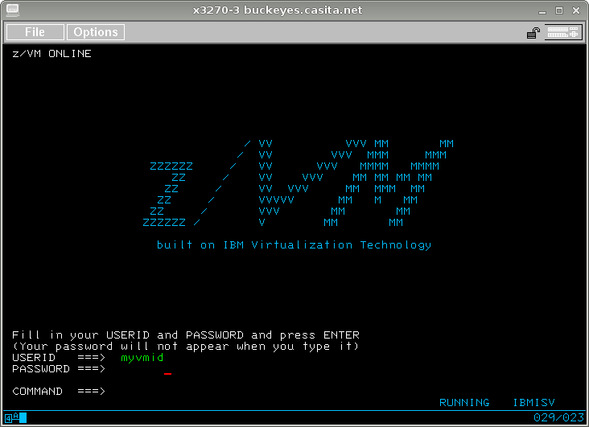
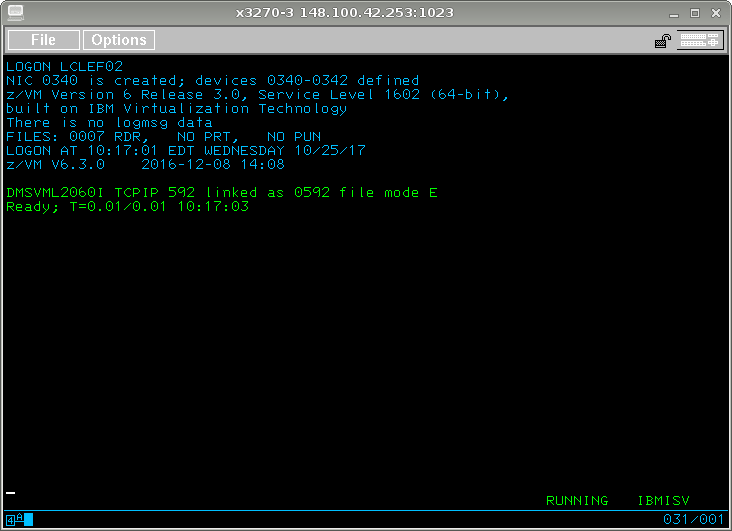
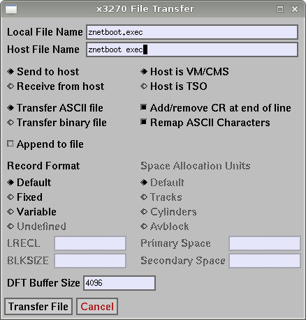
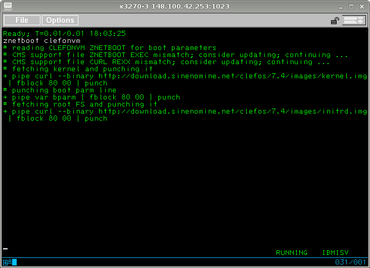

# ClefOS-on-VM

## Installing ClefOS on z/VM

This document describes how to install ClefOS on z/VM using ZNETBOOT. 
The target audience is those who may be skilled at using and installing Linux 
but not knowledgeable about z/VM or CMS. The purpose of this document is 
to enable installation of ClefOS as quickly and painlessly as possible 
by those who don't know CMS or z/VM. 

While this document was written specifically for ClefOS, 
it is applicable for NORD, SUSE, OpenSUSE, CentOS, Debian, Fedora, 
or any other Linux which can run on IBM Z architecture. In fact, 
the ZNETBOOT utility could theoretically be used for installing 
any operating system capable of running on IBM Z as long as 
the OS kernel can be retrieved from the web. 

## You Will Need

You will need a virtual machine. On z/VM, a virtual machine is also referred 
to as a user,  
and a user is assigned to a particular virtual machine. As a general purpose operating system, 
z/VM provides interactive computing services by defining each user as a 
virtual machine, typically running CMS.  But being true virtual machines, 
"users" of z/VM can run any operating system suitable for the IBM Z 
architecture. 

Your virtual machine should be defined for at least 1G of memory 
(RAM, “storage”) and have at least one disk of 5G or more (about 7000 
“cylinders” of 3390 type disk). The example here has two disks, 1B0 
and 1B1, both 10000 cylinders. The addresses and sizes of your disks 
will vary, but are by convention a three or four hexidecimal digit 
numner (here, '180', as a leading zero is conventionally dropped). 

Your virtual machine should also have a virtual NIC. 
The z/VM sysadmin will determine whether your NIC is set for Layer 2 
or Layer 3 (of the sevel layer ISO networking stack) and you will 
need to adjust the installation accordingly. 
The NIC will likely be coupled to routed network to a virtual switch. (No changes needed 
for virtual switch versus other connectivity modes.) In this example, 
the virtual NIC is defined at 340. The address of your NIC will probably 
be different. 

If DHCP (central IP address, routing, and nameserver assignment) is present, all one usually needs to know is the device name, and 
the system handles setting up off-host connectivity; If DHCP is not present, one 
should gather the following information:

`
1. Device name: (form: enccw0.0.0340):
1. IP v4:       (form: 192.168.0.5):
1. Netmask:     (form: 255.255.255.0):
1. IP gateway:  (form: 192.168.0.1):  

1. Nameserver:  (form: 8.8.8.8):
`

... Google notes there there is no purpose to also adding the `8.8.4.4` 
alternative nameserver, as there is a load-balancer in play which sends 
a request to either IP to the same backend

Additionally, your virtual machine should have standard CMS requirements, 
either an SFS space to serve as “filemode A” or (better) a 191 minidisk 
to serve as your “A disk”. You will of course need z/VM TCP/IP connectivity. 
(When running CMS, you should be able to run standard end-user internet 
tools and client utilities.) 

CMS is a single-user operating system available on z/VM for interactive work. 
For installing Linux, CMS acts as a self-sacrificing [chained] loader: It provides 
the underpinnings to do the uploads and run the ZNETBOOT utility. (see next) 
Once the kernel and other requisite files have been fetched and arranged, 
control is handed off to your virtual machine, whch will perform the rough equivalent of a kexec() function 
and then, CMS will step aside and vanish (thus: 'self-sacrificing')

## You Will Also Need

You will also need the ZNETBOOT tool, or at least two files from 
that package. Specifically, you will need "ZNETBOOT EXEC" and "CURL REXX". 
(Filenames in CMS are two part, divided by blank space. Those files 
would be "znetboot.exec" and "curl.rexx" on most other systems.) 

Uploading via X3270 is explained. If you use some other means 
than X3270 to connect with your z/VM host, your upload experience 
will be different. 

A third required file is "CLEFONVM ZNETBOOT" (aka "clefonvm.znetboot"), 
which will hold bootstrap parameters unique to your virtual machine. 
It must either be created with the CMS text editor 'xedit' or must be 
created on your desktop or laptop and then uploaded. There is an 
example included with the ZNETBOOT package and on the web, but the 
example will not work for your virtual machine because you will 
minimally have different network addresses. 

## Sign On

Using 'x3270', connect to your z/VM host. The z/VM logon screen will 
present three fields: USERID, PASSWORD, and COMMAND. Ignore the latter. 
Enter your virtual machine name in the USERID field. Enter your password 
in the PASSWORD field. (It will not be displayed.) 

Press \<Enter\>. 

Your virtual machine should boot CMS, quickly presenting a “Ready;” prompt. 
(CMS does not take long to boot.) 

Look at the lower right corner of your X3270 window for a status indicator. 
If you see “VM READ”, then press <Enter> again (just once). You should 
see “RUNNING”. 

## Upload ZNETBOOT

Retrieve the following files and upload them to z/VM. 

* http://www.casita.net/pub/znetboot/znetboot.exec     
* http://www.casita.net/pub/znetboot/curl.rexx     
* http://www.casita.net/pub/znetboot/clefonvm.znetboot     

You can use any web retrieval tool or method. 'wget' will do nicely. 

clefonvm.znetboot must be tailored to your virtual machine. Use your 
favorite plain text editor and change the IP address, netmask, network, 
and DNS server accordingly. Some of the statements, for example ...

    IPADDR=192.168.0.100     <<< your IP address goes here
    NETMASK=255.255.255.0    <<< your IPv4 netmask goes here
    GATEWAY=192.168.0.1      <<< your IPv4 gateway goes here

... and so forth. Save your changes to that file, then upload all three 
files to your virtual machine. 

These are all plain text files, not binary. 

To upload, use the X3270 file transfer dialogue. 
Hold down the left mouse button to bring up the "File" menu.
Slide down to "File Transfer ...".

Within the “File Transfer” dialogue, select “Send to host”, 
“Host is VM/CMS”, and “Transfer as ASCII file”. Then click 
"Transfer File". 

Files in CMS are identified with a filename, a blank, and then a 
filetype. Therefore `znetboot.exec` must be named `znetboot exec` on the 
“Host File Name” line. (This field is not case sensitive, so feel free 
to enter it as lower case.) Similarly for `curl.rexx` and `clefonvm.znetboot` 

## Run ZNETBOOT

When you have finished uploading the files, enter the following command: 

    znetboot clefonvm     

ZNETBOOT will read your CLEFONVM ZNETBOOT file and begin trying to 
download the kernel and initrd (and as optionally specified in the 
kernel command line, a remote 'kickstart.cfg' file)

Depending on network connectivity between your z/VM host and the 
repository, the CMS ?? 'pipe' commands may take a while to run. Give it time. 

ZNETBOOT will cache and queue-up the Linux files in your virtual reader and 
then once all are present, tell z/VM to boot (transfer input control) from the reader. You should see dozens, even 
hundreds, of lines of Linux console output. z/VM will pause the output 
one screen at a time. (Be patient. There is a way to speed that up, 
but it is much easier just to let it ride.) 

Once the installer has been brought up, you should see ...

[dracut.png]

## Install ClefOS

Congratulations! 

At this point you are finished with the X3270 part of the task. 
The rest should be very familiar. 

*** seemingly not a very good idea, without somehow locking access

Disconnect from the virtual console. This is optional. You can remain 
connected, but if you disconnect then z/VM will continue to run your 
virtual machine without any chance of network interruptions triggering 
unwanted console signals. Enter the command: 

    \#cp disconn

The hash/pound-sign is not a typo. The command is '#cp disconn' and 
press \<Enter\>. (It's optional. You don't strictly have to disconnect.) 

*** we need to hand in a SSH credneital, similar to that used for VNC 
installs, to secure the installation against highjacking

Use 'ssh' ...

[details to be gathered]

## Reboot

The ClefOS installer will automatically reboot. You do not need to be 
attached to your virtual console for this to happen. If you are 
connected then you will again see many screens of Linux console output scroll by. 

If your networking parameters are correct and the installation 
worked correctly, you can now SSH to your shiny new ClefOS mainframe 
virtual machine. 

Recovery is sometimes doable; other times re-installing to fix a typo seems 
easier

## Other Voices

IBM has an enormous library of freely available documention.  The underlying
z/VM environment is approachable described in: 

     Getting Started with z/VM for Linux

     http://publibz.boulder.ibm.com/epubs/pdf/hcsx0c31.pdf

Which is IBM document  SC24-6194-06 (August 2017)

In one of the discussion and community (and professional but free) support
mailing lists, that work was described by an IBM professional on one the
freely available mailing lists thus:

> One of the simplest is the Getting Started with z/VM for Linux manual that
> is part of the z/VM library.  It was intended as a basic fishing lesson,
> as opposed to just handing you fishing

     In IBM documentation idenfication, the last two digits indicate the 
revision level of the document, here: -06 and was released, not unexpectedly, in 
Augist 2017

There is something of acquiring a new skill in reading IBM documentation. 
They were said to be the third largest publisher of originally authored
document in the US, behind the US Department of Defense, and the Boy Scouts
of America.  Not surprising, each of the three is in the buisness of
training people from wholly ignorant of a field, to full competence. 
Reading the (fine manual) documentation is to learn from professionally
designed, and maintained training materials.  That said, as the
documentation cannot assay your particular level of competence in an area,
it has to have parts that you 'already know', and may safely skip over

As intimated, there are several mailing lists to whoch one may freely
subscribe, read, watch discussion between professionals, and so to learn.

FIXME -- add s390 list first

1. UARK 's390' list

Description

     http://listserv.uark.edu/cgi-bin/wa?LIST=IBMVM

Archive (authentication requires to prevent mailing list 'spam address farming)

     http://listserv.uark.edu/cgi-bin/wa?LIST=IBMVM

Or send an email with the word:

     help

or

     subscribe

in the body to: 

     IBMVM-request@LISTSERV.UARK.EDU

1. Fedoraproject 's390' mailing list

Archive (open, with email addresses obscured)

     https://lists.fedoraproject.org/archives/list/s390x@lists.fedoraproject.org/message/FKG4KTYU6UOKSB7Q6TUV4IXR5W74RV2R/

Or send an email with the word:

     subscribe

in the body to:

     s390x-request@lists.fedoraproject.org

=======

Have a lot of fun! 

